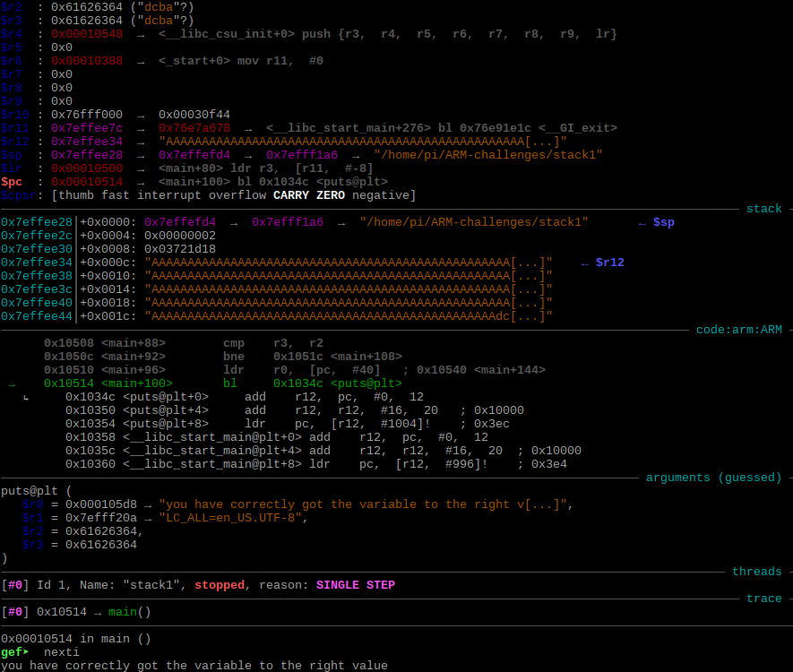

# Protostar ARM stack1

*I downloaded Protostar Stack Overflow challenges compiled for ARM from [Azeria Labs' GitHub](https://github.com/azeria-labs/ARM-challenges).*

### Finding starting point

I like to start from running the binary to see how it behaves - we can see that the binary expects an argument.  

I ran the binary in gdb with GEF and disassembled main function.  

From the screenshot above we can see two interesting functions - **errx** and **strcpy**. Errx is probably related to checking if arguments were given. We can confirm this by setting breakpoint on errx function (`b \*0x000104d8`) and running the next instruction (`nexti`).  

The second function is strcpy which has the potential to be vulnerable to buffer overflow.

So I removed existing breakpoint (in my case `del 1`) and put new breakpoint on the strcpy function by typing `b \*0x000104fc` and ran the program with an argument asdf (`run asdf`).  

We can see that our argument is now in registers r1 and r3. To observe how the binary works I ran `nexti` to step to the next instruction.
After strcpy function we can see that the value from the address r11 with offset -8 is going to be loaded into register r3 and the value from the pc registry with an offset 48 will be loaded into register r2. The next instruction compares both of these two values.
Right now, the register r3 holds value **0x0** and register r2 **0x61626364**.  

After running a few more instructions, we got a message "Try again, you got 0x%08x".

After that, we can conclude that we need to put **0x61626364 ("dcba"?)** value in the register r3. 

### Determining the right value

So we run the binary again with longer argument (`run asdfasdfasdfadsfasdfasdfasdfasdfasdfsdfadsfasdfasdasdfasdfasdfasdfasdfasdfasd`).

After loading value to the r3 we can see that it has a part of our argument - 0x73616664 ("dfas"?).

And now we can see that the values in r2 and r3 registries are somehow similar.  

Which takes us a little closer but it still not the same. After running another few instructions we again get "Try again, you got 0x%08x" message.

So evidently we have to put the value **dcba** (or in hex **0x61626364**) into register r3.

To find exact place we will use python script that will create our pattern and then calculate the offset - I used [pattern\_tools](https://github.com/jbertman/pattern_tools).

With the script inside our current directory we run python and we call pattern\_create function to create pattern with 256 characters.  

We then put breakpoint on `cmp r3, r2` instruction with `b \*0x00010508`, copy the created pattern and suply this into our binary in gdb.  

We can see that r3 register has now **0x63413163 ("c1Ac"?)** value.
We copy the address from r3 registry and run the `pattern_tools.pattern_offset('0x63413163')` function in python.  

We got the information that the offset is 64, so now we know, that after 64 characters we will override the value in r3 register.

### Overwriting the variable value

#### From the gdb

I created the argument by typing `python -c "print 64 * 'A' + 'dcba'"` and supplied this to gdb (`run AAAAAAAAAAAAAAAAAAAAAAAAAAAAAAAAAAAAAAAAAAAAAAAAAAAAAAAAAAAAAAAAdcba`).  

And now we can see that values in r3 and r2 registries are equal. After few `nexti` we get the message "you have correctly got the variable to the right value".

#### From the terminal

Different way to run this binary is to create argument with hex value of **dcba**, that is **0x61626364**. As the binary is in little endian format (we can check endianness by typing `rabin2 -I stack1`), we need to rotate the hex value to get **\x64\x63\x62\x61**.

Now we can create our argument with `$ python -c "print 64 * 'A' + r'\x64\x63\x62\x61'"` command.

We will use the command `$ printf "AAAAAAAAAAAAAAAAAAAAAAAAAAAAAAAAAAAAAAAAAAAAAAAAAAAAAAAAAAAAAAAA\x64\x63\x62\x61" | xargs ./stack1` to pipe this argument into our binary.  

