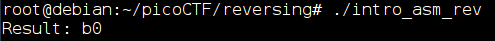

# picoCTF 2018 assembly-0

*picoCTF 2018 problems are available at [https://2018game.picoctf.com/problems](https://2018game.picoctf.com/problems)*

### assembly-0 problem

**Question:** What does asm0(0xc9,0xb0) return?  
**intro_asm_rev.S:**
```asm
.intel_syntax noprefix
.bits 32
	
.global asm0

asm0:
	push ebp
	mov ebp,esp
	mov eax,DWORD PTR [ebp+0x8]
	mov ebx,DWORD PTR [ebp+0xc]
	mov eax,ebx
	mov esp,ebp
	pop ebp	
	ret
```

### Solution by reading the code

Before the asm0 function is called, function arguments and EIP (Extended Insertion Point) are pushed into the stack:  


When the first instruction from asm0 function (`push ebp`) is ran, the stack will now contain:  


Now we have two interesting instructions `mov eax,DWORD PTR [ebp+0x8]` and `mov ebx,DWORD PTR [ebp+0xc]`. These instructions copy 32-bit integer found under **ebp+0x8** and **ebp+0xc** addresses and store them into EAX and EBX registers accordingly.

If we look at the stack, we can see that EBP is now pointing into just pushed EBP value. Because values stored on stack are 32 bits, which is 4 bytes, address **ebp+0x8** points to ARGV[1] on stack and **ebp+0xc** points into ARGV[2] value:  


In our case, ARGV[1] is **0xc9** and ARGV[2] is **0xb0**. So now we have **0xc9** value in register EAX and **0xb0** value in register EBX.

Next instruction, `mov eax, ebx`, move value from EBX register to EAX so now value **0xb0** is stored in register EAX.

Because the return value from the function is stored in the EAX register, the answer for the question is **0xb0**.

### Solution by running the code

*I will be running this 32-bit ELF on 64-bit architecture.*

As I want to learn more about assembly I wanted to run this program and print the return value. I wrote C code to call the asm0 function with provided arguments (**0xc9** and **0xb0**).  
**intro_asm_rev.c**:
```c
#include <stdio.h>

extern int asm0(int a, int b);

int main()
{
    int a = 0xc9;
    int b = 0xb0;
    printf("Result: %x\n", asm0(a, b));
    return 0;
}
```
To compile **intro_asm_rev.c** and **intro_asm_rev.S** I removed `.bits 32` line from **intro_asm_rev.S** file. But even after compiling this code, the binary was returning **Segmentation fault**.

As my mentor pointed out (*thanks RG!*) the problem was laying with [ABI](https://wiki.osdev.org/System_V_ABI#i386). As I understood, the problem was in the way in which ABI handled the registers in functions, especially the fact that the EBX register should not be changed while a function is executed.
To improve this code, RG added two instructions - one that pushes EBX value to the stack at the beginning of the asm0 function and one that takes this value back at the end of the function.  
Final content of the **intro_asm_rev.S** file:
```asm
.intel_syntax noprefix
	
.global asm0

asm0:
	push ebp
	mov ebp,esp
	push ebx //RG
	mov eax,DWORD PTR [ebp+0x8]
	mov ebx,DWORD PTR [ebp+0xc]
	mov eax,ebx
	pop ebx //RG
	mov esp,ebp
	pop ebp	
	ret
```

After making these changes, the binary was compiled with the following command:
`gcc -m32 intro_asm_rev.S intro_asm_rev.c -o intro_asm_rev -ggdb3 -O0 -pedantic-errors -std=c89 -Wall -Wextra -pedantic`

And the result:  

